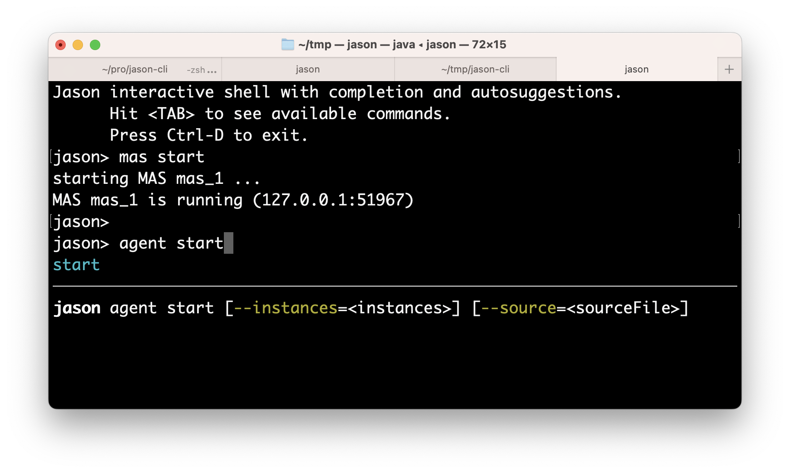

# Command Line Interface (CLI) for Jason

This project provides a CLI for Jason users. 

Example of use in a terminal (`jason>` is the prompt for JasonCLI):

    jason> mas start
    jason> agent start bob
    jason> agent start alice {
        !start.
        +!start <- .send(bob,tell,hello).
    }
    jason> agent beliefs bob
        hello[source(alice)]
    jason> agent run-as bob { .send(alice,tell,hello) }
    jason> exit


In this example, 

* an (empty) MAS is created in the first command, 
* agent bob is created (second command) -- with no beliefs or plans; 
* agent alice is created (third command) -- with an initial goal and plan. 
* alice achieves the goal `!start` by sending a message to  bob
* the beliefs of bob are shown (fourth command). 
* bob also send a hello message to alice (fifth command).
* the MAS is finished (last command).

The shell provides completion and suggestions (using `<TAB>`).



## Installation

Java 17 is required.

    git clone https://github.com/jason-lang/jason-cli.git
    cd jason-cli
    ./gradlew jar
    export PATH=`pwd`/build/scripts:$PATH

These commands will: download JasonCLI, build it, and add `jason` command in the `PATH`. 
Ideally, change the `PATH` in the initialization of your terminal.

## Uses

### Interactive Shell

Type the command `jason`: 

    $ jason
    Jason interactive shell with completion and autosuggestions.
      Hit <TAB> to see available commands.
      Press Ctrl-D to exit.
    jason>

the `<TAB>` key is your new 'mouse' to explore the system.

### Scripts

Create a script file, for instance, a file called `hello.jcli` with content:

```
mas start
agent start bob {         # starts bob with a plan
    +hello[source(A)] <- .print("hello from ",A).
}
agent start alice
agent run-as alice { .send(bob,tell,hello) }  # alice executes the .send...

echo "beliefs of Bob:"
agent beliefs bob         # show beliefs of bob
```

then  run it with

    $ jason < hello.jcli

the output in the _MAS Console_ will be:

```
[alice] done
[bob] hello from alice
```

and the output in the terminal is:

```
Jason interactive shell with completion and autosuggestions.
      Hit <TAB> to see available commands.
      Press Ctrl-D to exit.
jason> starting MAS mas_1 ...
MAS mas_1 is running (127.0.0.1:56149)
jason> agent start bob {
add: }>         +hello[source(A)] <- .print("hello from ",A).
add: }>     }
agent bob started.
jason> agent alice started.
jason> agent run-as alice { .send(bob,tell,hello) }
jason>
jason> beliefs of Bob:
jason>     hello[source(alice)]
jason>
<end of script>
```

### Command Line

In your preferred terminal:

    $ jason mas start --console

In another terminal:

    $ jason mas start m1

In another terminal:

    $ jason mas list
    $ jason mas stop --mas-name=m1 --exit


(commands for agents are in ToDo)

